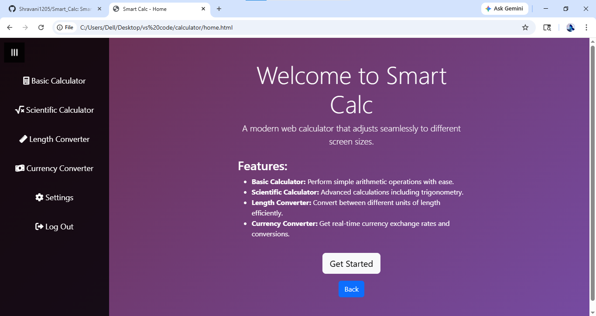
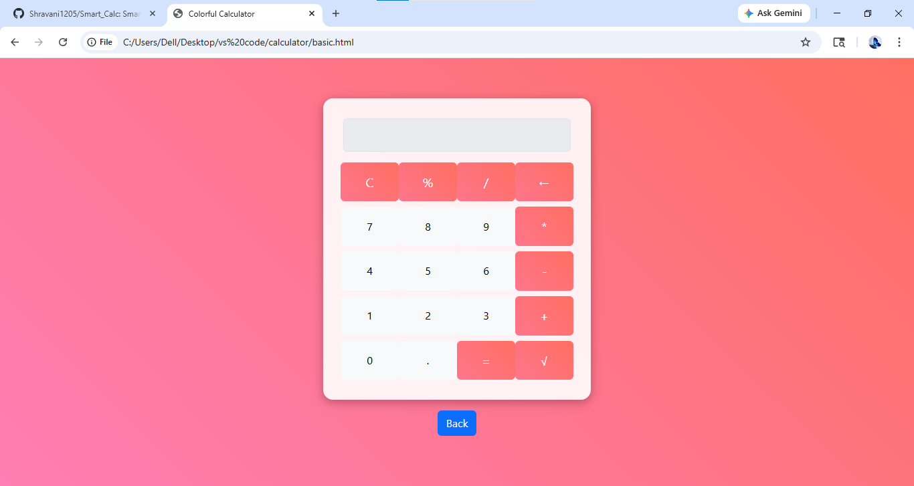
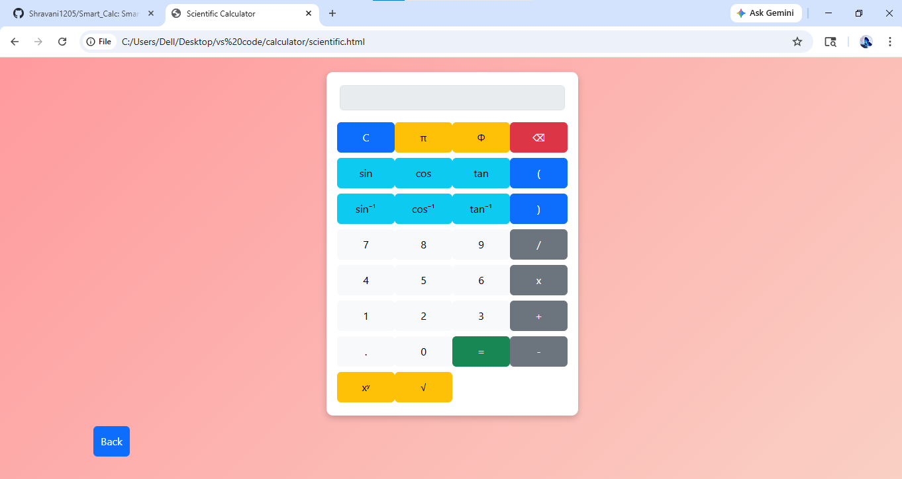
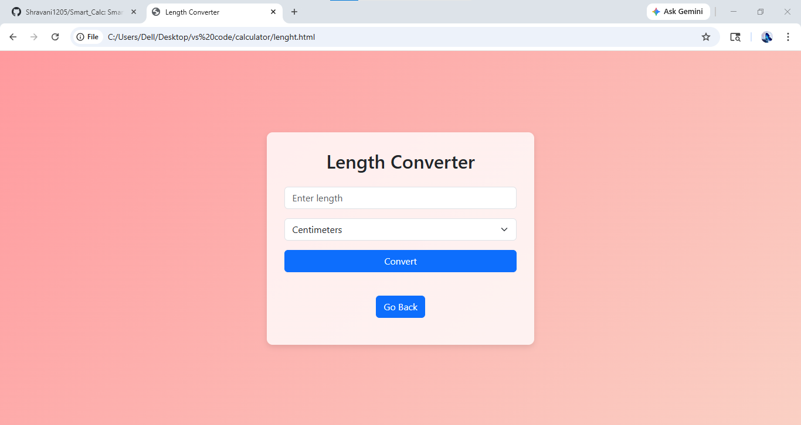

# Smart_Calc
A responsive web-based calculator built using HTML, CSS, JavaScript, and Bootstrap. It supports basic operations with a clean and user-friendly interface.
## Features
- Performs basic arithmetic operations(+, -, *, /).
- Responsive design( works on mobile & desktop).
- Clean and modern user interface.
- interactive buttons and smooth functionality.
## Technologies Used
- HTML
- CSS
- JavaScript
- Bootstrap
## Screenshots

  
  
   
  
   
    

## Learning outcome
This project helped me improve my javascript logic, UI design, and problem-solving skills.
## GitHub Repository
https://github.com/Shravani1205/Smart_Calc

  
